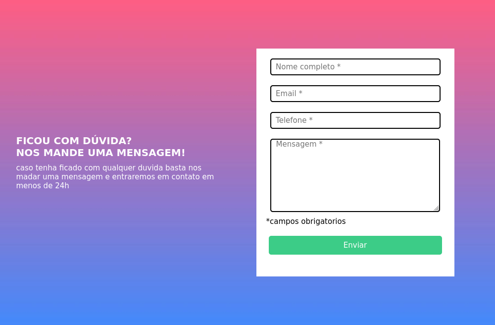
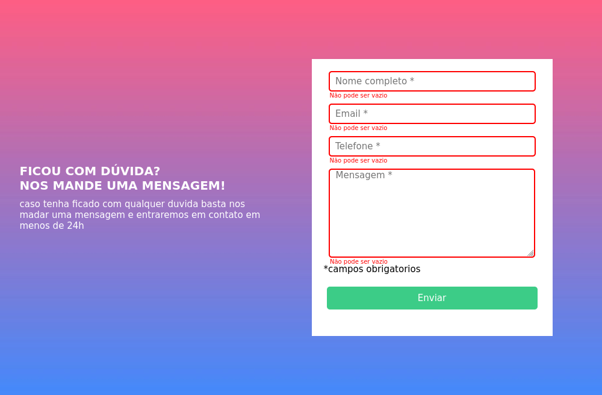
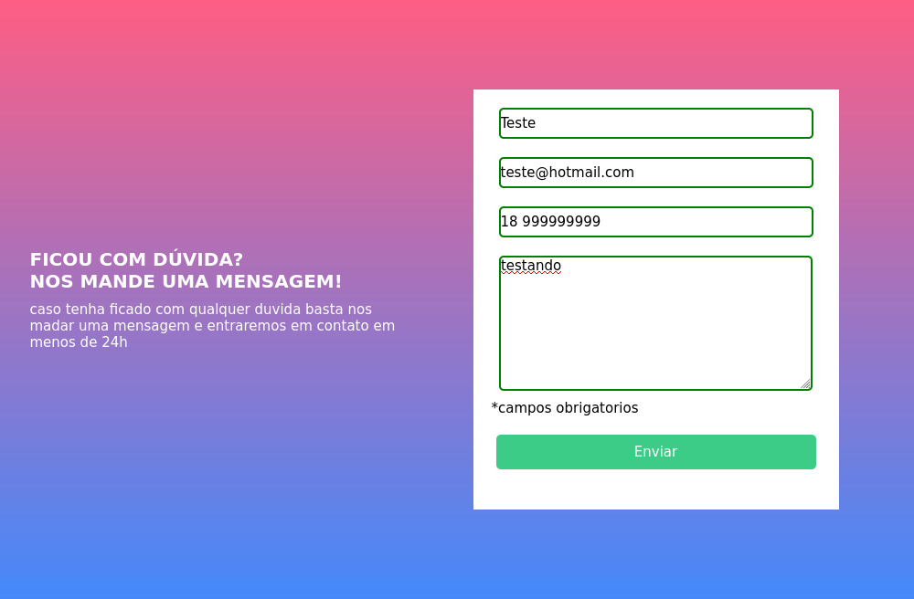

# Validação de inputs

O projeto é um desafio frontend proporcionado pelo Dev em Dobro, 
ele possui um formulario com inputs, é feita uma validação dos inputs quando o botão "Enviar"
é acionado, verificando os campos vazios e colocando mensagens de erro.

## Tecnologias Utilizadas

- HTML
- CSS
- JS

## Preview

